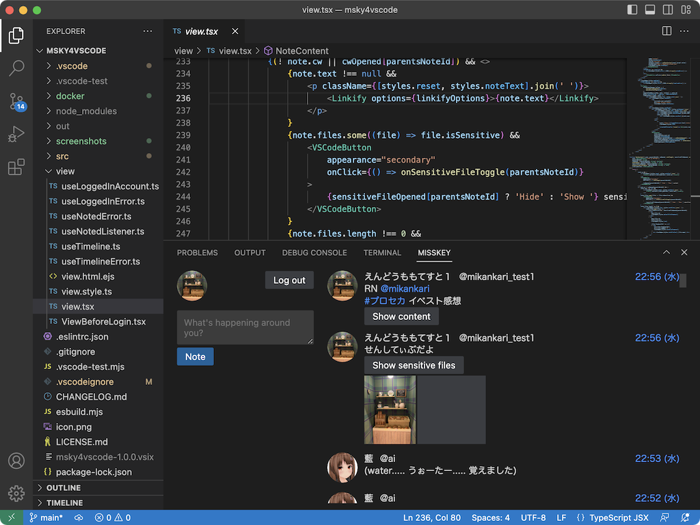
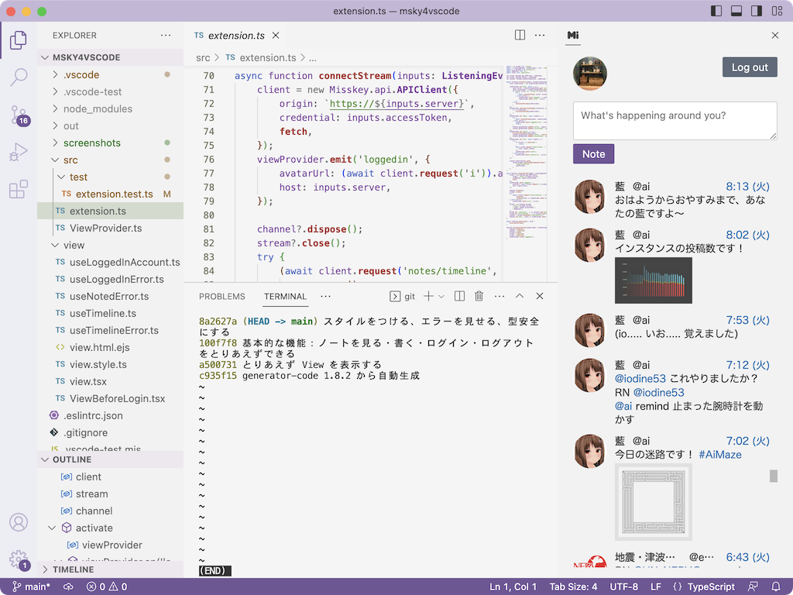
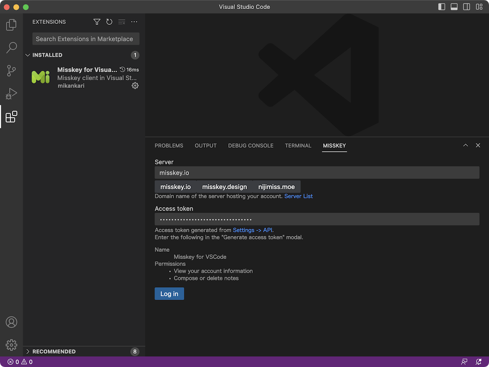

# Misskey for Visual Studio Code

Visual Studio Code エディタ上の Misskey クライアント

## 機能

ノートの基本的な読み書きができます

- ホームタイムラインをリアルタイムに見る
- CW (Content Warning) を表示・非表示
- 添付ファイルを見る
- センシティブな添付ファイルを表示・非表示
    - 本家クライアントと異なり、ノートの添付ファイルへ一括して表示・非表示します
- ノートを投稿する

表示場所はパネルのほか、タブ名 "MISSKEY" やアイコン "Mi" をドラッグすることで、プライマリまたはセカンダリサイドバーにも表示できます

### 未実装機能

代わりに、ノート右上の時刻から開く本家クライアント上で操作をお願いします

- ローカルタイムラインなどを見る
- センシティブな添付ファイルを含むノートを非表示
- カスタム絵文字の表示
- MFM の表示
- リアクションを見る
- リアクションする
- 投票する
- ノートを投稿するときの設定

## インストール

Visual Studio Code 内の拡張機能マーケットプレースからインストールできます  
「misskey」などで検索して、「Misskey for Visual Studio Code」をインストールします

## 必要なもの

任意の Misskey サーバーのアカウントが必要です  
misskey.io と nijimiss.moe のアカウントで動作確認済みです

ログイン時に Server と Access token を入力します

Server にアカウントが属する Misskey サーバーのドメイン名を入力します

Access token は本家クライアントの 設定 -> API から発行します  
「アクセストークンの発行」のモーダルで次を入力します

<dl>
<dt>名前</dt>
<dd>Misskey for VSCode</dd>
<dt>権限</dt>
<dd>「アカウントの情報を見る」を有効にする</dd>
<dd>「ノートを作成・削除する」を有効にする</dd>
</dl>

「✔️」を押して発行されたアクセストークンを Access token に入力します

「Log in」を押して、タイムラインを表示します

**Enjoy!**
